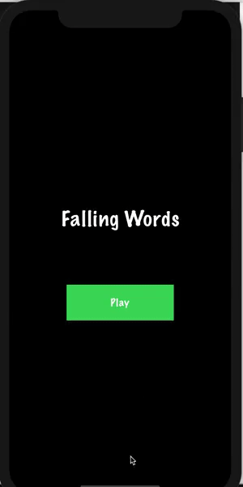

# Falling Words

## Introduction
This is a simple words translation guessing game. A word in English will be displayed on screen and it's possible translation will be falling down from. User has to tell wether the the translation is **Right** or **Wrong** . For every right answer.

For every right answer, User score is increment by 1. Nothing will be awraded or deducted on wrong answer. If user doesnt select an answer, it will be considered as wrong.

## Technical Details

## Tech-Stack
### About Project
This project is an iOS application written in **Swift 5** using **Xcode 11.6**. It uses a local json file for data. No external dependency is used. Project is divided in to three main cateogories

- AppStartup
  It contains all the clases that are needed to start the application
 
- App
  It contains all the application related work. It's further divided into **Scenes**, **Domain** and **Data** layers.
 
 - Commons
    It contains general purpose utilities.

### Architecture 
This project is build using the Uncle [Uncle Bob's Clean architecture](https://blog.cleancoder.com/uncle-bob/2012/08/13/the-clean-architecture.html) . Project is divided into three main layers

- Domain : It's the buisness logic of the app and it's independent of other application's modules or technologies. 
- Data : It's the database layer of the app. It contains the storage of the app as well as the RepositryInterface implementations to talk to Domain.
- Scenes : It's the UI part of the application. I have used MVVM-N to implement it. 

## Game Play

